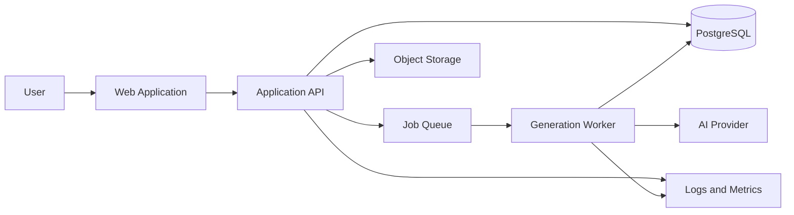
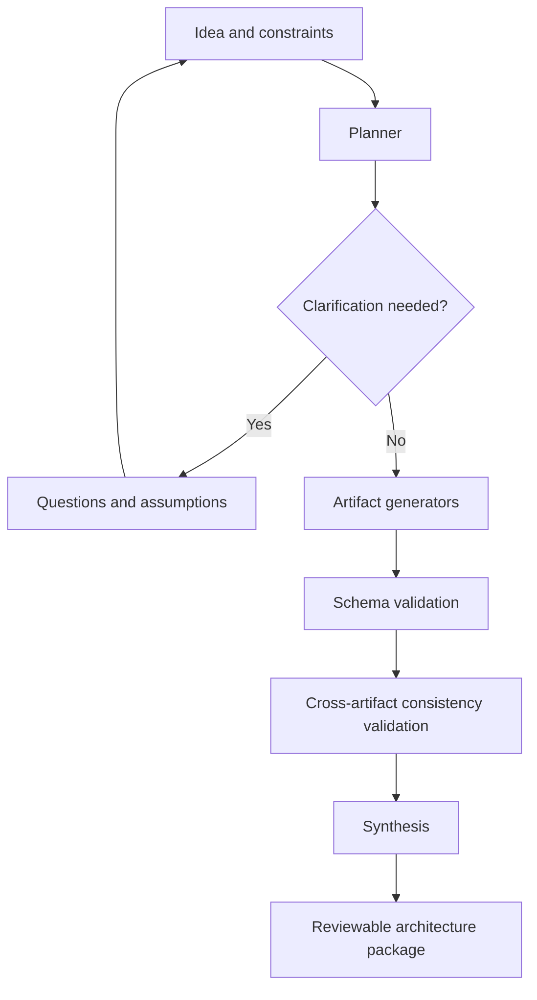

# Archon Architecture

**Status:** Proposed  
**Last updated:** 2026-07-18

## Architecture goals

- produce structured, reviewable architecture artifacts
- preserve user-approved constraints across revisions
- isolate long-running AI generation from request-response traffic
- validate model outputs before persistence or export
- keep provider and model choices replaceable
- provide traceability without storing secrets

## Proposed system context

## Proposed components

### Web application

Responsible for project intake, clarification, artifact review, revision, approval state, and export controls.

### Application API

Responsible for authentication, authorization, project persistence, artifact versioning, job creation, export assembly, and audit metadata.

### Generation worker

Runs planning, artifact generation, schema validation, consistency checks, and synthesis outside the interactive request path.

### PostgreSQL

Stores users, workspaces, projects, inputs, artifact revisions, decisions, assumptions, questions, jobs, and export metadata.

### Redis-backed queue

Coordinates retryable generation jobs, progress, rate limits, and worker concurrency.

### AI provider adapter

Encapsulates model requests, structured output schemas, retries, usage metadata, and provider-specific behavior.

## Generation pipeline

## Data principles

- Every generated artifact is versioned.
- Approval state belongs to a specific revision.
- Generated proposals, user decisions, assumptions, and open questions are separate records.
- Generation jobs reference the exact input and schema versions used.
- Regeneration creates a new revision rather than mutating approved history.

## Trust boundaries

- Browser input is untrusted.
- AI output is untrusted until validation passes.
- Authorization is enforced by the API, never only by the UI.
- Provider credentials remain server-side.
- Export rendering must escape or sanitize untrusted content.

## Initial deployment shape

A modular monolith plus background worker is recommended for the MVP. This keeps transactional boundaries and development overhead manageable while allowing generation workloads to scale independently.

Separate services should be introduced only when measured load, security isolation, or team ownership requires them.

## Decision records

Significant architecture choices must be captured under `docs/adr/`. Proposed choices are not considered approved until reviewed and merged.
